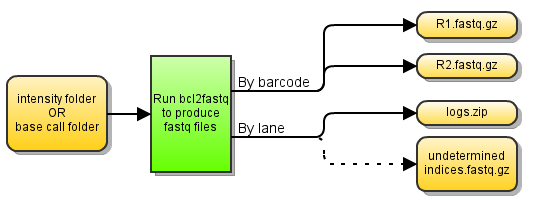

##bcl2fastq workflow

Version 2.9

###Overview

Uses [Illumina](http://www.illumina.com/) run folders to produce fastq files using [SeqWare](http://seqware.github.io/) and [bcl2fastq](http://support.illumina.com/downloads/bcl2fastq-conversion-software-v2-18.html). The "CASAVA" name is a misnomer since bcl2fastq is used exclusively, but is maintained for historical purposes.



###Dependencies

This workflow requires:

* [SeqWare](http://seqware.github.io/)
* [Bcl2fastq](http://support.illumina.com/downloads/bcl2fastq-conversion-software-v2-18.html) 2.18.0.12

###Compile
When compiling, you most likely will need to add the -Dbcl2fastq-bin flags in order to configure it properly. An example is below.
```
mvn clean install -Dbcl2fastq-bin=/path/to/bcl2fastq
```

###Usage
After compilation, [test](http://seqware.github.io/docs/3-getting-started/developer-tutorial/#testing-the-workflow), [bundle](http://seqware.github.io/docs/3-getting-started/developer-tutorial/#packaging-the-workflow-into-a-workflow-bundle) and [install](http://seqware.github.io/docs/3-getting-started/admin-tutorial/#how-to-install-a-workflow) the workflow using the techniques described in the SeqWare documentation.

####Options
These parameters can be overridden either in the INI file on on the command line using `--override` when [directly scheduling workflow runs](http://seqware.github.io/docs/3-getting-started/user-tutorial/#listing-available-workflows-and-their-parameters) (not using a decider). Defaults are in [square brackets].

Required:

    run_folder                dir         Sequencer run directory
    intensity_folder          dir         Sequencer run intensity directory 
    called_bases              dir         Instrument BaseCall directory
    lanes                     string      Defines the lanes and barcodes for the sequencer
                                          run. See the documentation for more information
    flowcell                  string      Name of the flowcell (i.e. sequencer run)

Input/output:

    output_prefix             dir         The root output directory
    output_dir                string      The sub-directory of output_prefix where the output
                                          files will be moved
    manual_output             true|false  When false, a random integer will be inserted into
                                          the path of the final file in order to ensure 
                                          uniqueness. When true, the output files will be
                                          moved to the location of output_prefix/output_dir
                                          [false]

Optional:

    read_ends                 int         Number of ends [2]
    ignore_missing_bcl        true|false  Appends --ignore-missing-bcl to bcl2fastq call
    ignore_missing_filter     true|false  Appends --ignore-missing-filter to bcl2fastq call
    ignore_missing_positions  true|false  Appends --ignore-missing-positions to bcl2fastq call
    ignore_missing_stats      true|false  Appends --ignore-missing-stats to bcl2fastq call
    use_bases_mask            string      Appends the value of --use_bases_mask and the given 
                                          string to bcl2fastq call
    no_lane_splitting         true|false  Appends --no-lane-splitting to bcl2fastq call
    mismatches                int         Sets the number of mismatches permitted [1]
    other_bcltofastq_options  string      A catch-all for any other options you want to pass 
                                          to the BCLtofastq program
    queue                     string      Name of the (SGE) queue to schedule to [production]
    memory                    int         Amount of memory given to the node on the cluster,
                                          in MB [4000]

####Lanes
The `lanes` parameter defines the lanes and barcodes for the sequencer run. Only entities mentioned in this string will be split into fastq files. All other reads will end up in the Undetermined_indices folder.

Format: `<lane_number_[1-8]>,<lane_sw_accession>:<barcode|NoIndex>,<sw_accession_for_parent>,<sample_name>[,<group_id>]+<barcode|NoIndex>,<sw_accession_for_parent>,<sample_name>[,<group_id>]|...`

* lane_number: the lane number in the flowcell (1-8)
* lane_sw_accession: the SeqWare accession of the lane in the MetaDB
* barcode : the index/barcode or "NoIndex"
* sw_accession_for_parent : Usually the IUS SeqWare accession that describes the barcode
* sample_name : the human-readable name of the sample
* group_id : an optional identifier that further classifies a sample, for example into a experimental group

Example: `1,8291:NoIndex,192939,PCSI_0106_Ly_R_PE_190_WG+ACGT,198594,PCSI_0106_Ly_R_PE_190_WG,group1` : lane 1 (accession 8291) has two samples: an unbarcoded sample (NoIndex, accession 192939) named PCSI_0106_Ly_R_PE_190_WG and a barcoded sample (ACGT accession 198594) named PCSI_0106_Ly_R_PE_190_WG in group 1.

The accessions are required because they link the fastq files with a lane, IUS and sample so that subsequent analysis can be automated for the named samples.

###Output files
**fastq.gz files** : Produces filenames with the format: SWID_9858_PCSI_0106_Ly_R_PE_190_WG_NoGroup_110916_SN804_0064_AD04TBACXX_NoIndex_L001_R1_001.fastq.gz
* SWID_9858 : IUS SeqWare accesssion
* PCSI_0106_Ly_R_PE_190_WG : library name
* NoGroup : the group_id if it exists or 'NoGroup'
* 110916_SN804_0064_AD04TBACXX : the sequencer run name
* NoIndex : the barcode if there is one or 'NoIndex'
* L001 : The lane number in the format L00#
* R1 : either R1 or R2 depending on the read number
* 001 : meaningless (?) suffix maintained for convention

**reports zip** : Zip of the bcl2fastq "Reports/html" output directory: Reports_110916_SN804_0064_AD04TBACXX_1.zip
**stats zip** : Zip of the bcl2fastq "Stats" output directory: Stats_110916_SN804_0064_AD04TBACXX_1.zip
* 110916_SN804_0064_AD04TBACXX : the sequencer run name
* 1 : lane number

**Undetermined_indices.zip** :  if in a particular lane there is no 'NoIndex', a R1 and R2 fastq.gz file will also be produced containing any reads that were not allocated to one of the fastq files

###Support
For support, please file an issue on the [Github project](https://github.com/oicr-gsi) or send an email to gsi@oicr.on.ca .
